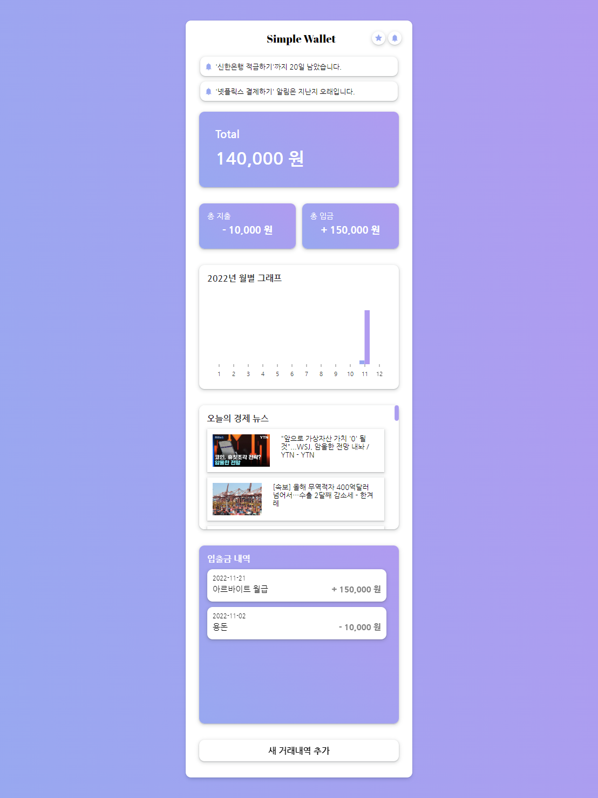
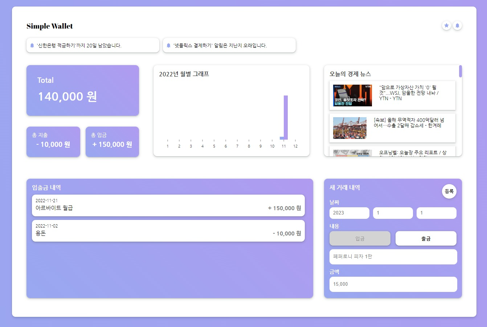
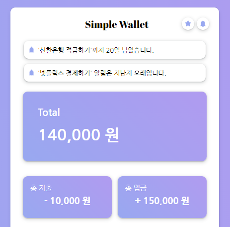
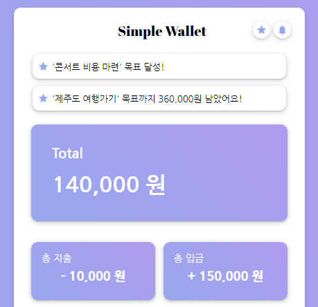
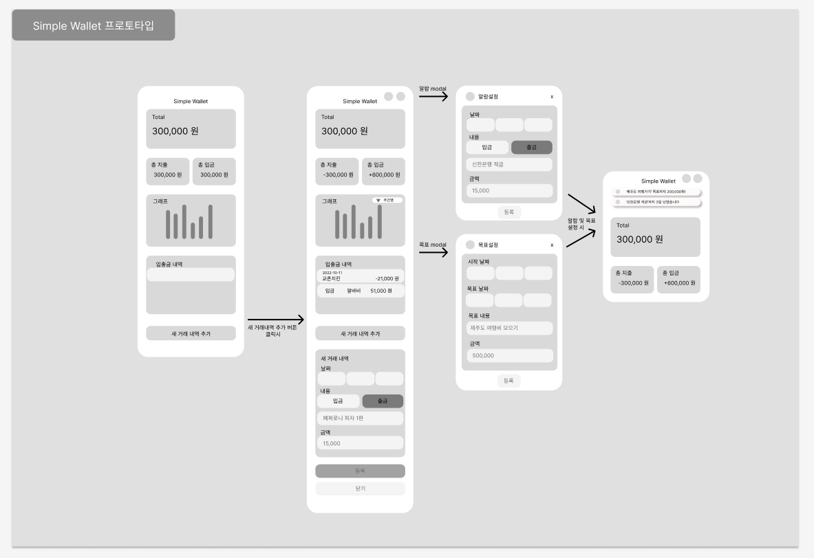
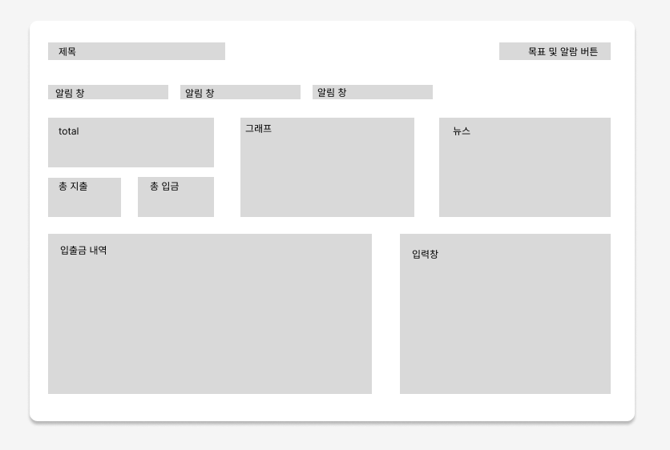

# Simple Wallet

> 알차고 간단한 기능이 탑재된 가계부 웹 어플리케이션

> Javacript 코드를 Typescript로 변환한 버전


<br>

## 실행

```shell
yarn

yarn start // local 서버로 실행

json-server --watch data.json --port 4000 // DB server 실행 
```

`localhost:3000` : 로컬 접속


<br>

## 사용

- React
- CSS3 & HTML
- Javascript  ( 변환 전 코드 : https://github.com/5Suminsss2/Simple-Wallet )
- Typescript 
- Recoil
- Styled-Component
- Yarn
- Figma (레이아웃)
- json-server (서버 라이브러리)

<br>

## 목차

- [기능](#기능)
- [구현](#구현)
- [트러블 슈팅](#트러블-슈팅)

<br>

---


## 기능


### 반응형

화면 사이즈에 따라 구성 변화

| Mobile 버전        |   Desktop 버전          |
| ----------------------- | -------------------------- |
|  |  |


<br>

### 알림 기능

| 알람 설정 기능         | 목표 설정 기능          |
| --------------------- | ---------------------- |
|  |  |

| 일정 기간 전/후 알람 기능 | 목표 금액 전/후 알람 기능 |
| ---------------------- | ---------------------- |
|  |  |

<br>

### 입출금 관리 기능

| 총 입출금 금액 입력 시, 실시간 반영 | 총 입출금 금액 삭제 시, 실시간 반영 |
| ----------------------------- | ----------------------------- |
|  |  | 
 

<br>

### 경제 뉴스 추천 기능

| 경제 뉴스 추천 기능      |
| ---------------------- |
|  |


<br>

---

<br>

## 구현

### 레이아웃 (Figma를 사용해 구현)

**모바일 버전 레이아웃**



**데스크탑 버전 레이아웃**



### 파일별 역할

**src/components**

| 파일명 | 역할                                          |
| ----------------- | --------------------------------------------- |
| `AccountHistory`    | 입출금 내역 관리 폴더  |
| `Alarm`    | Main 페이지에 배치되는 알림 기능 관리 폴더 |
| `Chart`    | Main 페이지에 배치되는 차트 기능 관리 폴더 |
| `Modal`    | 알람 기능과 목표 알림 기능을 추가할 수 있는 모달 관련 폴더 |
| `News`    | NewApi를 활용하여 경제 뉴스 추천 기능 관리 폴더 |
| `CreateAccountHistory.tsx`    | 입출금 등록 기능 파일 |
| `Title.tsx`    | Main 화면의 Header 부분 관리 파일  |
| `Total.tsx`    | 등록된 입출금 내역을 총 잔액, 총 입금, 총 출금으로 나눈 관리 기능 |

**src/pages**

| 파일명 | 역할        |
| ------ | ----------- |
| `Main.tsx` | 메인 페이지 |

**src/store**

| 파일명     | 역할             |
| ---------- | ---------------- |
| `atom.ts` | Recoil로 상태관리할 수 있도록 컴포넌트가 구독할 수 있는 React State 모음 파일 |

**src/hooks**

| 파일명     | 역할             |
| ---------- | ---------------- |
| `usePromise.ts` | api가 주는 비동기 데이터를 비동기적(Promise)으로 받아올 수 있게 도와주는 훅 |

**src/api**

| 파일명     | 역할             |
| ---------- | ---------------- |
| `getData.ts` | 데이터를 받아오는 api 모음 파일 |

<br>

### 반응형
1. media query로 반응형 웹 및 모바일 개발
2. 모바일(기본), 웹(1200px 이상, 1600px 이상일 경우로 구분하여 개발)
``` css
  @media screen and (min-width: 1200px) {
    width: 17vw;
  }

  @media screen and (min-width: 1600px) {
    width: 250px;
  }
```

<br>

### 알림 기능
1. 상태관리로 `Recoil`을 사용해 데이터 관리
``` ts
  const alarmDataset = useRecoilValue(alarmDatasetState); // useRecoilValue로 현재 기본값 가져오기
```
2. 알람 및 목표 기능 생성을 위한 modal 구현
``` ts
  const [alarmOpen, setAlarmOpen] = useRecoilState(alarmModalState); // useRecoilState로 모달 기능 오픈 여부 확인
```
3. 알람 및 목표 기능 추가 시, 기존 데이터베이스 값이 변경되는 것을 인지한 Recoil이 화면 상 데이터를 Refresh 없이 바꿈
``` ts
   const [dataset, setDataset] = useRecoilState(alarmDatasetState); // useRecoilState로 기존 데이터 가져오기
   setDataset([inputs, ...dataset]); // 데이터 수정
```

<br>

### 입출금 입력 기능 
1. 입출금 입력 시, Recoil을 통해 데이터 변화 관리
``` ts
   const [dataset, setDataset] = useRecoilState(datasetState); // useRecoilState로 기존 데이터 가져오기
   setDataset([inputs, ...dataset]); // 데이터 수정
```   
2. axios로 입출금 데이터 Create, Read, Delete 기능 관리
``` ts
  await axios.post(`${process.env.REACT_APP_API_URL}/accountHistoryData`, inputs) // EX) axios post로 등록
  ...
```

<br>

### 경제 뉴스 추천 기능 
1. NewsApi에서 제공하는 무료 뉴스 데이터 api를 사용하여 경제 뉴스 추천 기능 구현
2. promise를 사용하여 비동기적으로 데이터 처리
``` ts
   // NewsContainer.tsx
   const [loading, response, error] = usePromise(() => {
      return axios.get(
        `https://newsapi.org/v2/top-headlines?country=kr&category=business&apiKey=${process.env.REACT_APP_NEWS_API_KEY}`
      );
    }, []);
    
    // usePromise.ts
    export default function usePromise(promiseCreator, deps) {
      // 로딩중 / 완료 / 실패에 대한 상태 관리
      const [loading, setLoading] = useState(false);
      const [resolved, setResolved] = useState(null);
      const [error, setError] = useState(null);

      useEffect(() => {
        const process = async () => {
          setLoading(true);
          try {
            const resolved = await promiseCreator();
            setResolved(resolved);
          } catch (e) {
            setError(e);
          }
          setLoading(false);
        };
        process();
      }, deps);
      // eslint-disable-next-line react-hooks/exhaustive-deps
      return [loading, resolved, error];
    }

```

### 입출금 분석 그래프 기능 
1. React 차트 라이브러리인 Nivo에서 Bar 그래프를 사용하여 입출금 분석 그래프 기능 구현

<br>

### 카테고리 별 지출 분석 그래프 기능 
1. React 차트 라이브러리인 Nivo에서 Pie 그래프를 사용하여 카테고리 별 지출 분석 그래프 기능 구현

<br>

### 총 입출금 금액 계산 기능
1. Recoil을 활용하여 총 입출금 계산 기능 구현
``` ts
  const [total, setTotal] = useRecoilState(totalState); // total 금액 가져오기
  let deposit = 0; 
  let withDraw = 0;

  // 입출금 내역 데이터 계산
  dataset.map(function (element) {
    if (element.accountType === "Deposit") {
      deposit += Number(element.price);
    } else {
      withDraw += Number(element.price);
    }
  });
  
  // 입출금 내역 금액 데이터 변경
  setTotal(deposit - withDraw);
```
<br>

## 트러블 슈팅

<br>

### 입출금 데이터 추가 시, 자동으로 차트에 반영이 되지 않는 이슈

**문제**
- 초기 데이터로 bar chart가 잘 그려지는데 나중에 데이터가 추가적으로 입력되면 자동으로 차트에 반영되지 않는 현상이 발생했다.

**해결**
1. 원인 분석
``` ts
  // 기존 코드
  const dataset = useRecoilValue(datasetState);
  const filterDataset = dataset.filter(
      (value) => Number(value.year) === today.getFullYear()
  );
    
  // monthData에 값 더하기
  filterDataset.map((value) => {
    const month = Number(value.month)-1;
    if (value.accountType === "Deposit") {
        monthData[month].totalDeposit += Number(value.price);
    } else {
        monthData[month].totalWithdraw += Number(value.price);
    }
  }
);
```
- 기존 코드로 입력할 때, 리렌더링이 되지 않는 현상이라고 파악하였다.
- 그래서 useEffect와 useState를 사용해서 코드를 수정했지만 이슈를 해결하지 못하였다.

2. 해결방안
리액트에서 리렌더링 되는 조건에 대해서 다시 조사하였다.
- 컴포넌트 자신의 state가 변하기
- 부모 컴포넌트로부터 받는 props가 변하기
- 부모 컴포넌트가 리렌더링 되기

이 중, 부모 컴포넌트로부터 받는 props가 변하기를 적용하여 코드를 수정했더니 이슈를 해결할 수 있었다.

- 자세한 정리 : https://ksumin-dev.tistory.com/133

<br>

### 데이터 삭제가 되지 않는 이슈

**문제**
- 구현 목표 : 댓글 삭제 버튼을 누르는 즉시, 새로고침하지 않고 댓글이 삭제되는 현상 나타나기
- 내가 생각한 방법 : - axios.delete로 삭제하고, useState를 사용해서 새로고침 하지 않아도 댓글이 삭제 될 수 있도록 구현했다.
- 문제 발생 : 하지만, 그 후 새로고침을 누르면 다시 댓글이 원상복구 되는 문제점을 파악했다.

**해결**

axios delete는 해당 데이터의 id를 찾아 삭제하는 방식으로 운영된다.

하지만, 이번 프로젝트에서 사용한 json-server는 데이터가 입력되는 즉시, id를 반영하지 못하였다.

그렇기에, 임의의 id(기존 데이터 개수 + 1)를 데이터 생성할 때 넣어주었다.

``` ts
   const [dataset, setDataset] = useRecoilState(datasetState); //기존 데이터
   const [inputs, setInputs] = useState({
    accountType: "deposit",
    year: "",
    month: "",
    date: "",
    accountContents: "",
    price: 0,
    id: datasetState.length + 1, // 기존 데이터 개수의 +1을 하여 id 구상
  });
```
이렇게 되면 문제점이, 총 3개의 데이터가 있고, id가 2인 데이터를 삭제한 후에 새 데이터를 등록하면 id가 3인 데이터로 생성되고 기존 id가 3이었던 데이터와 충돌하게 되어 등록이 되지 않는다.

그래서 id를 숫자가 아닌 무작위의 문자 (uuid)를 생성하여 데이터 생성 시 id로 넣어주어 이슈를 해결하였다.
``` ts
   function uuidv4() {
    return "xxxxxxxx-xxxx-4xxx-yxxx-xxxxxxxxxxxx".replace(
      /[xy]/g,
      function (c) {
        var r = (Math.random() * 16) | 0,
          v = c == "x" ? r : (r & 0x3) | 0x8;
        return v.toString(16);
      }
    );
   }
  
    const [inputs, setInputs] = useState({
    accountType: "deposit",
    year: "",
    month: "",
    date: "",
    accountContents: "",
    price: 0,
    id: uuid4(), // 기존 데이터 개수의 +1을 하여 id 구상
  });
```
<br>

---

<br>

## 학습한 내용

### recoil로 상태관리 하기
지난 세미나에서 Redux를 대안할 수 있는 상태관리 라이브러리인 Recoil에 대해서 발표했었다.

이 기술을 적용한 개발을 하는 것이 이번 프로젝트의 핵심 목표였기 때문에 Recoil의 주요 기능을 학습하고 적용했다.

사용한 주요 기능은 다음과 같다.
``` ts
  // 주요 기능
  const [total, setTotal] = useRecoilState(totalState); // 1. useRecoilState : 기존 데이터를 수정할 수 있다.
  const goalDataset = useRecoilValue(goalDatasetState); // 2. useRecoilValue : 기존 데이터가 무엇인지 읽을 수 있다.(ReadOnly라서 수정 불가능)
```

리덕스처럼 복잡하게 개발하지 않고 atom과 useRecoil__ 기능들을 이용하면 간단하게 상태관리를 할 수 있다는 장점을 파악했다.

<br>

### 서버를 개발하지 않고 REST API 구축하기
이번 프로젝트는 프론트만 개발하여 진행해야했고 빠른 시간 내로 진행해야하는 시간 제약이 있었다. 

DB를 사용해야하는 상황이었는데 DB를 사용하기 위해선 백엔드 서버로 접근을 해야 안전하게 DB에 접속할 수 있었다.

주변 사람들의 조언과 여러 검색을 통해 백엔드 서버 코드를 짜지 않아도 db에 접근할 수 있는 도구들이 있다는 사실을 알게 되었다.

1. Firebase
- firebase에서는 실시간 db를 무료로 제공해준다. 
- 심지어 간단하게 api 주소만 axios/fetch에 입력하면 db에 데이터를 보내거나 받아오거나 삭제하거나 수정할 수 있다

2. json-server
- npm install만 하면 간단히 사용할 수 있다.
- json-server를 실행하는 즉시, db.json이라는 파일이 src 밖에 생기고 그 파일에 모든 데이터가 생성된다.
- 역시 axios/fetch에 api주소 (localhost:3000/db이름)을 입력하면 GET, POST, DELETE, PUT 모두 접근이 가능하다.

3. 최종 선택
- 기존에 json파일에 data를 넣어두었기 때문에 json-server로 진행하는 것이 이 프로젝트에서는 더 편리하다고 생각해 json-server를 선택했다.
- 정말 간단하게 이용할 수 있어 백엔드 서버를 구축할 시간을 아낄 수 있었다. 

<br>

### promise
경제 뉴스 추천 기능을 만들기 위해서 외부 api를 사용했다.

그런데 api에서 준 데이터가 비동기로 처리되어 있어 기존 axios.get 방식으로는 데이터를 받아올 수 없었다.

그래서 promise를 사용해 비동기적으로 데이터를 받아오는 usePromise hook을 만들어 개발했다.

(참고 서적 : react를 다루는 기술 )

<br>

``` ts
import { useState, useEffect } from "react";

// promiseCreator : promise를 만들어주는 함수, 데이터를 가져오는 함수(axios,fetch)가 들어가야한다.
// deps: 의존배열 (이 코드에선 틀을 잡기 위해 임시로 사용)

export default function usePromise(promiseCreator, deps) {
  // 로딩중 / 완료 / 실패에 대한 상태 관리
  const [loading, setLoading] = useState(false);
  const [resolved, setResolved] = useState(null);
  const [error, setError] = useState(null);

  useEffect(() => {
    const process = async () => {
        setLoading(true);
        try {
          const resolved = await promiseCreator();
          setResolved(resolved);
        } catch (e) {
          setError(e);
        }
        setLoading(false);
      };
      process();
    }, deps);
    // eslint-disable-next-line react-hooks/exhaustive-deps
    return [loading, resolved, error];
  }

  ```
<br>

### styled component 위치 
CSS module을 주로 써와서 Styled-Component에 대해 학습하고 개발에 적용해봤다.

이를 사용할 땐, `Component 함수 스코프 외부`에 위치해야한다.

그렇지 않으면 warning이 뜨고 내 경우엔 input에서 onChange함수가 문제가 발생했다. 

input 값이 바뀔 때마다 리렌더링이 되고 리렌더링 될 때, Styled Component로 꾸며진 부분이 다시 불러오게 되면서 값이 입력이 되지 않는 현상이 나타난다.

그래서 Component 함수 스코프 외부에 위치해야 리렌더링의 영향을 받지 않을 수 있다.

<br>

## 그 외 기록들
개발 블로그에 정리했다.
- <a href="https://ksumin-dev.tistory.com/129">[토이프로젝트] input 입력 시 한글자만 입력되고 더이상 입력되지 않는 에러가 발생</a>

- <a href="https://ksumin-dev.tistory.com/130">[토이프로젝트] useState를 이용해 기존 배열에 값 추가하기</a>

- <a href="https://ksumin-dev.tistory.com/131">[토이프로젝트] jsx에서 else if문 사용하는 방법</a>

- <a href="https://ksumin-dev.tistory.com/134">[토이프로젝트] Styled-Component에서 구글 폰트 사용하기 </a>

- <a href="https://ksumin-dev.tistory.com/136">[토이프로젝트] 리액트에서 onClick이 자동으로 동작하는 에러 해결 </a>


## 앞으로 추가할 기능
- ✅ 카테고리 별 분석 그래프 (완료)
- ✅ 타입스크립트로 변환 하기 (완료)
- ⬜ Electron을 사용하여 데스크탑 앱으로 개발 
